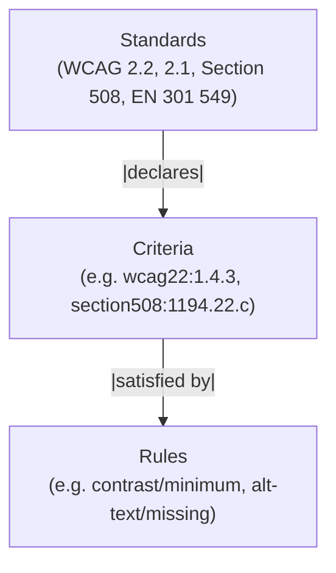

# ra11y

> **AI-first accessibility scanner.** Multi-standard. Zero runtime dependencies. Designed for MCP agents, usable from the CLI.

[](https://www.npmjs.com/package/@ra11y/core)
[](https://github.com/vanctran/ra11y/actions)
[](./LICENSE)
[](./package.json)
[](https://www.typescriptlang.org/)

**`ra11y`** (pronounced "rally") is built primarily for an AI coding agent calling its tools — not a human staring at a dashboard. Every response shape, noise-vs-signal decision, and per-finding hint is designed for one-shot agent triage: a scan returns ranked findings with WCAG citations, ready-to-paste suppression comments, primary fix paths, and a `nextStep` pointer so the loop closes in one round-trip.

That doesn't make it agent-only. ra11y ships a CLI with beautiful terminal output, four report formats, and precommit integration. It covers JSX/TSX, HTML, and CSS across four standards out of the box — WCAG 2.2, WCAG 2.1, Section 508, and EN 301 549 — and a plugin API for adding more. Coverage reports and a VPAT-ready certification scorecard sit alongside line-level violations, so the same tool your agent runs in Cursor also tells your legal team where you stand on ADA conformance.

> **Status: pre-release (v0.0.x).** The engine, plugin API, 49 rules, four built-in standards, eight output formatters, four report kinds (coverage, checklist, VPAT, certification), and a 12-tool MCP server are in place. The v0.1.0 milestone targets the first npm release. See [`CHANGELOG.md`](./CHANGELOG.md) for what's landed.

## Design priorities

- **AI-first MCP server.** A 12-tool surface built for agent workflows — `scan_project`, `checklist`, `suggest_fix`, `detect_native_wrappers` — with responses shaped for one-shot triage (ranked fix paths, per-finding suppression pragmas, `nextStep` hints, scan-confidence telemetry).
- **Zero runtime dependencies.** Nothing in `dependencies`. Everything in-house. Tiny install, minimal supply-chain surface — what a compliance tool should look like.
- **Multi-standard by architecture.** Standards → Criteria → Rules, with cross-standard equivalences. One rule satisfies WCAG 2.2, WCAG 2.1, Section 508, and EN 301 549 simultaneously; adding a new standard never touches rule code.
- **VPAT + certification scorecard.** `--vpat`, `--certification`, and `--checklist` produce the shape legal and compliance teams actually need.
- **Precommit-speed.** Sub-second on typical commits, performance budget enforced in CI.
- **First-class TSX + Tailwind.** JSX/TSX parsing and Tailwind class resolution ship in the default scan, not behind a plugin.
- **Plugin API for custom standards.** Bring your own internal accessibility spec; the engine treats it the same as the built-ins.

## Install

```sh
bun add -D @ra11y/core
# or
npm install -D @ra11y/core
# or
pnpm add -D @ra11y/core
```

Install is instantaneous — zero runtime dependencies means zero transitive downloads.

## Quickstart

```sh
npx ra11y src/
```

The following output comes from running ra11y against its own test fixtures (`tests/fixtures/bad/contrast-minimum/` and `tests/fixtures/bad/alt-text-missing/`):

```
  ra11y v0.0.0

┌─ tests/fixtures/bad/alt-text-missing/img-no-alt.html ─────────
│
│  ✗  2:1     document/page-titled
│              HTML document is missing a <title> element — browsers and screen readers have nothing to announce.
│              WCAG 2.2 · 2.4.2
│              Fix: Add a <title>…</title> to <head> describing the page topic or purpose. Keep it specific — 'Settings — Acme' is better than 'Acme'.
│
│  ✗  5:5     media/alt-text-missing
│               'revenue-2026.png' is missing a text alternative — screen readers will announce the file name or nothing at all.
│              WCAG 2.2 · 1.1.1
│              Fix: Add alt describing what the image communicates (e.g., alt="revenue 2026"). If the image is purely decorative — mark it with alt="" instead.
│
└───────────────────────────────────────────────────────────────

┌─ tests/fixtures/bad/contrast-minimum/low-contrast.css ────────
│
│  ✗  2:1     contrast/minimum
│              '.muted-note' has color contrast ratio 2.17:1 against its background — WCAG 1.4.3 requires 4.5:1 for normal text.
│              WCAG 2.2 · 1.4.3
│              Fix: Darken the foreground (`color: #b0b0b0`) or lighten the background (`background: #ffffff`). The current ratio is 2.17:1; you need 4.5:1.
│
│  ⚠  2:1     contrast/enhanced
│              '.muted-note' has color contrast ratio 2.17:1 against its background — WCAG 1.4.6 requires 7:1 for normal text.
│              WCAG 2.2 · 1.4.6
│
└───────────────────────────────────────────────────────────────

  ✗ 6 errors   ⚠ 2 warnings   in 4 files · 8ms

  Coverage  WCAG 2.2  30/34 automatable passing (88%) · 52 need manual review
```

Each violation cites the WCAG success criterion, the exact element or selector, and a fix suggestion based on the surrounding context — not a generic rule description.

## How it works

ra11y separates what to check (rules) from why it matters (criteria) from which framework cares (standards). This lets one rule satisfy WCAG 2.2, Section 508, and EN 301 549 simultaneously, without duplicating logic.

The diagram below shows the three-layer model. An arrow from Standards to Criteria means a standard declares a set of criteria. An arrow from Criteria to Rules means a criterion is satisfied by one or more rules.



A scan with `--standard section508` activates the same `contrast/minimum` rule and cites the Section 508 criterion ID in output — no rule changes needed. Adding a new standard is one file with criterion records and `equivalentTo` pointers into WCAG.

Architecture deep-dive: [`docs/architecture.md`](./docs/architecture.md).

## Common commands

```sh
ra11y --changed                     # Scan only git-staged files (precommit)
ra11y --since main                  # Scan files changed since a git ref
ra11y --standard wcag22,section508  # Run multiple standards at once
ra11y --level AA                    # Enforce conformance level
ra11y --format sarif                # GitHub code scanning output
ra11y --format agent                # AI agent-optimized JSON (see below)
ra11y --baseline=create             # Freeze existing violations
ra11y --coverage                    # Per-standard coverage summary
ra11y --vpat                        # Generate VPAT-ready report
ra11y --certification               # Generate readiness scorecard
ra11y --checklist                   # Manual review checklist
ra11y --explain contrast/minimum    # Rule detail, spec quote, examples
ra11y --list-rules                  # All 49 built-in rules
ra11y --list-standards              # All 4 built-in standards
```

Full CLI reference: [`docs/cli.md`](./docs/cli.md).

## Agent mode

ra11y's primary consumer is an AI agent calling its tools. Every response is built to answer "what do I do next?" in a single round-trip — structured findings, ranked fix paths, per-finding suppression syntax, scan-confidence telemetry, and a `nextStep` hint. What that looks like in practice:

- **Surface, don't suppress.** False positives a human might tune out are cheap for an agent to dismiss with one file read. Heuristic suppression loses signal the agent would actually use.
- **Honest telemetry about gaps.** Counts of opaque custom components, files with template directives, parse-error files, CSS vs markup coverage — with one-line hints the agent can act on ("call `detect_native_wrappers`", "point `additionalPaths` at `dist/`").
- **Ranked fixes.** Where a rule has multiple resolution paths, ra11y picks a primary from source signals (icon chars in visible text, aria-label shape, etc.) so `suggest_fix` output can be piped deterministically.
- **Context-aware noise filtering.** A `setTimeout` in `authManager.ts` or `useDebouncedCallback.ts` is pre-annotated "likely not user-facing" so the agent dismisses in one pass instead of opening the file.

`--format agent` outputs the same shape from the CLI for pipeline use:

```sh
ra11y src/ --format agent | claude-code --stdin
```

The output includes:
- **Plan summary** — "15 findings (12 auto-fixable). Most common: button-name (5), handler-missing (4)." — so the agent can form a strategy before reading individual findings
- **Findings grouped by file** — with fix confidence (`high`/`medium`/`low`), safety (`safe`/`unsafe`), effort (`trivial`/`moderate`/`significant`), and the exact `// ra11y-ignore` suppression syntax
- **Review candidates** — locations where the agent should evaluate manual WCAG criteria, with the question to answer, pass/fail criteria, and suggested fix

```json
{
  "plan": { "totalFindings": 15, "fixSuggestionAvailable": 12, "summary": "..." },
  "files": [{ "path": "src/Button.tsx", "findings": [{ "fix": { "confidence": "high" }, "..." : "..." }] }],
  "reviewCandidates": [{ "question": "Does this text rely solely on sensory characteristics?", "..." : "..." }]
}
```

## Configure

`ra11y.config.ts`:

```ts
import { defineConfig } from "@ra11y/core";

export default defineConfig({
  standards: ["wcag22", "section508"],
  level: "AA",
  exclude: ["node_modules", "dist", "**/*.test.tsx"],
  overrides: [
    {
      files: ["src/legacy/**/*.tsx"],
      rules: { "contrast/minimum": "warn" },
    },
  ],
});
```

## Precommit integration

Scan only files staged in git, and fail the commit on any error:

```sh
ra11y --changed --fail-on error
```

With [lefthook](https://github.com/evilmartians/lefthook):

```yaml
# lefthook.yml
pre-commit:
  commands:
    ra11y:
      run: bunx ra11y --changed --fail-on error
```

Or use ra11y's baseline mode to adopt on an existing codebase without fixing everything up front:

```sh
ra11y --baseline=create    # freeze existing violations
ra11y --baseline=check     # only new violations fail the scan
```

Examples for CI and precommit tools: [`examples/`](./examples).

## Plugin API

Standards and rules are both pluggable. Adding a new accessibility framework is one file:

```ts
import { defineStandard } from "@ra11y/core/plugin";

export default defineStandard({
  id: "coga",
  name: "Cognitive Accessibility Guidelines",
  version: "1.0",
  publisher: "W3C WAI",
  url: "https://www.w3.org/TR/coga-usable/",
  levels: ["base"],
  criteria: [
    /* … */
  ],
});
```

Rules declare coverage across every loaded standard:

```ts
import { defineRule } from "@ra11y/core/plugin";

export default defineRule({
  id: "custom/no-placeholder-as-label",
  satisfies: ["wcag22:3.3.2", "coga:clear-instructions"],
  severity: "error",
  // …
});
```

End-to-end templates: [`examples/plugin-rule/`](./examples/plugin-rule/) and [`examples/plugin-standard/`](./examples/plugin-standard/). Architecture deep-dive: [`docs/architecture.md`](./docs/architecture.md).

## MCP Server (AI Agent Integration)

ra11y ships a built-in [MCP](https://modelcontextprotocol.io) server so AI coding agents (Claude Code, Cursor, Zed, Continue) can scan, explain, and fix accessibility issues interactively.

**Setup** — add this to your project's `.mcp.json`:

```jsonc
{
  "mcpServers": {
    "ra11y": {
      "command": "npx",
      "args": ["@ra11y/core", "--mcp"]
    }
  }
}
```

Or start the server directly: `ra11y --mcp`

**Available tools (12):**

| Tool | Purpose |
|------|---------|
| `scan` | Scan files or directories for violations |
| `scan_project` | Full-project scan with rule-grouped summary |
| `scan_file` | Fast single-file re-scan (cached ASTs) |
| `detect_native_wrappers` | Discover PascalCase design-system wrappers to suppress false positives |
| `explain_rule` | Full rule docs, WCAG quote, good/bad examples |
| `explain_standard` | Standard metadata and criterion list |
| `suggest_fix` | Concrete fix suggestion for a specific violation |
| `coverage` | Per-standard compliance scorecard |
| `checklist` | Manual review items with evaluation prompts |
| `review_candidates` | Locations needing human judgment with the question to answer |
| `list_rules` | Discover all loaded rules with metadata |
| `configure` | Set session defaults (standard, level, excludes) |

**Typical agent workflow:** `scan_project` to get findings → `explain_rule` for unclear ones → apply fixes → `scan_file` to verify → `coverage` to check overall compliance.

**First-run flags (for an agent meeting a new codebase):**

```jsonc
// scan_project args
{
  "cwd": "/abs/path/to/project",
  "autoDetectWrappers": true,          // auto-register PascalCase-with-onClick as nativeWrappers
                                       // for this scan — closes the "47 opaque components" gap
                                       // in one call. Scope is scan-only; session stays pristine.
  "additionalPaths": ["dist/assets"],  // bypass .gitignore + default build-dir skips to scan
                                       // post-compile Tailwind/CSS-in-JS output.
  "verboseMeta": true                  // expand analysisCoverage to include file lists and
                                       // rulesByExtension for scan-confidence debugging.
}
```

Full setup guide: [`docs/mcp/server-setup.md`](./docs/mcp/server-setup.md).

**Example agent interaction:**

> **User:** Scan this project for WCAG AA issues and tell me which are easiest to fix.
>
> **Agent** calls `scan_project` with `{ "standard": "wcag22", "level": "AA" }`. ra11y returns 15 findings grouped by file. Agent calls `suggest_fix` for the three `contrast/minimum` findings. Agent responds: "Three contrast failures in `Card.tsx` are trivial — the suggested color values are already in the response. Two missing `alt` attributes in `Hero.tsx` need descriptive text you'll need to supply. The remaining ten are medium-effort keyboard and ARIA issues."

## Contributing

See [`CONTRIBUTING.md`](./CONTRIBUTING.md). TL;DR: TypeScript only, Bun-first, zero runtime deps, every rule cites WCAG, conventional commits, `bun run verify` before committing. Claude Code users: see [`CLAUDE.md`](./CLAUDE.md) for the autonomous-development workflow and the Orchestrator-Workers pattern the project is built around.

## License

MIT © ra11y contributors
